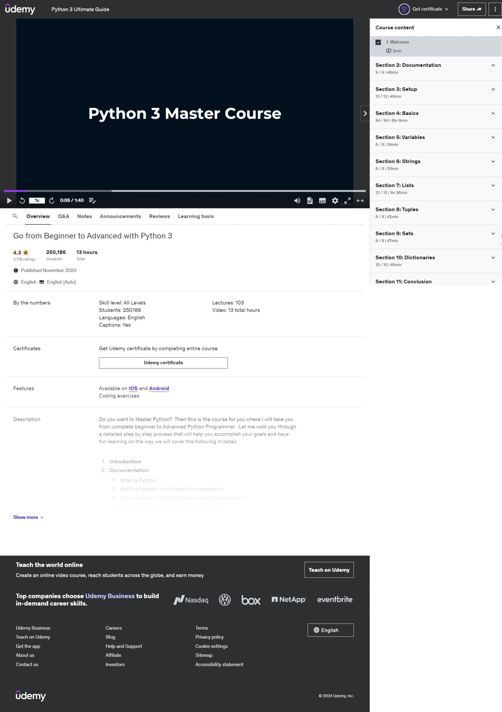
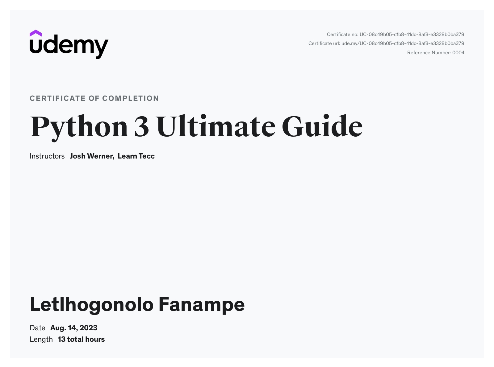

# Python 3 Master Course for 2021 - Tutorials



This repository is a collection of tutorials and exercises I completed as a student of the **Udemy Python 3 Ultimate Guide** course. The course is freely available and I highly recommend it to anyone interested in learning Python.

**Course Overview:**
- **Instructor:** Josh Werner
- **Rating:** 4.3 out of 5 (3,718 ratings)
- **Total Students:** 250,186
- **Duration:** 13 hours
- **Published:** November 2020
- **Language:** English
- **Lectures:** 103
- **Certificates:** Available upon completion

**Course Content:**
- Introduction to Python
- Python Documentation Resources
- Porting from Python 2 to Python 3
- Python Basics: Syntax, Data Types, Functions, Classes, and more
- Advanced Topics: Modules, JSON, RegEx, and PIP

## Project Directory Structure

```
Python3-MasterCourse-2021-Tutorials/
│
├── 02. Visual Studio Code Python Script/
│   ├── 02. Visual Studio Code Python Script.code-workspace
│   └── vsc.py
│
├── 03. Python Basics/
│   ├── 01. Syntax.ipynb
│   ├── 02. Comments.ipynb
│   ├── 03. Data Types.ipynb
│   ├── 04. Numbers.ipynb
│   ├── 10. For Loops.ipynb
│   ├── 11. Functions.ipynb
│   ├── 14. Classes and Object.ipynb
│   ├── 16. Iterators.ipynb
│   ├── 17. Scopes.ipynb
│   ├── 18. Modules.ipynb
│   ├── 19. Dates.ipynb
│   ├── 23. Pip.ipynb
│   ├── 27. Strings.ipynb
│   ├── 28. Lists.ipynb
│   ├── 29. Tuples.ipynb
│   ├── 30. Sets.ipynb
│   ├── user input.ipynb
│   └── 09. While Loops.ipynb
│
└── README.md
```
This repository serves as a collection of reference code and examples for anyone interested in learning Python programming.

Enjoy exploring and happy coding!

