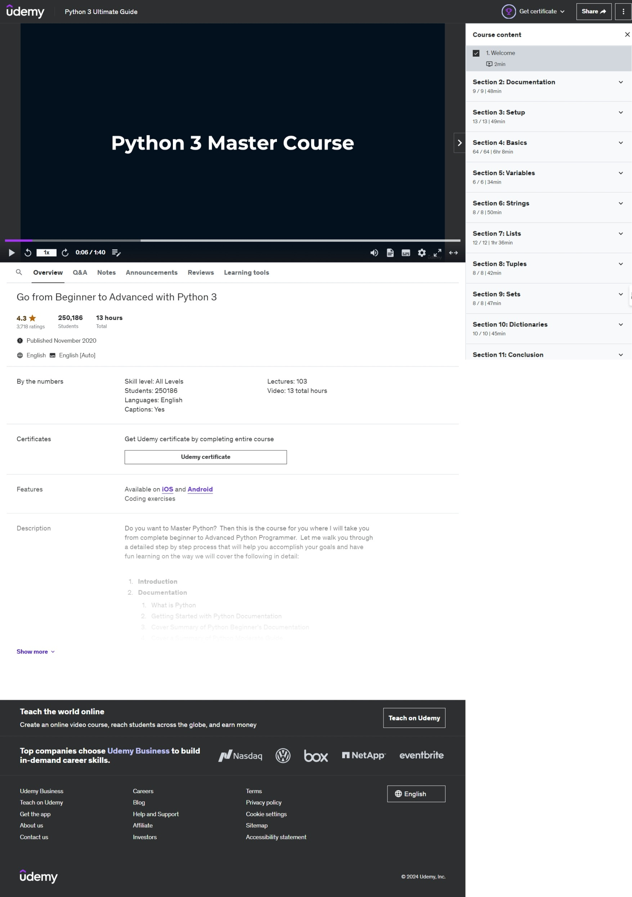

# Python 3 Tutorials and Exercises

This repository contains Python 3 code examples and exercises covering a wide range of topics, from basic syntax to data structures, functions, and modules. 

## Course Information

These tutorials and exercises are based on the "Python 3 Ultimate Guide" course on Udemy.

**Course Details:**

- **Platform:** Udemy
- **Title:** Python 3 Ultimate Guide
- **Instructor:** Josh Werner
- **Skill Level:** All Levels
- **Language:** English
- **Content:**
    - Introduction to Python
    - Setting up Python Development Environment (IDLE, VS Code, Anaconda)
    - Python Basics (Syntax, Comments, Data Types, Operators, Control Flow, Functions, Lambda, Arrays, Classes, Objects, Inheritance, Iterators, Scope, Modules, Dates, Math, JSON, RegEx, PIP, Try/Except, User Input, String Formatting, Variables)
    - Data Structures (Strings, Lists, Tuples, Sets, Dictionaries)

## Repository Structure

The repository is organized into folders, each representing a specific topic or concept covered in the course. Each folder contains code examples and exercises related to that topic.

## Usage

Feel free to explore the code examples and use them as a reference for your own Python projects. The exercises are designed to help you practice and solidify your understanding of the concepts.

## Disclaimer

I am not the creator of the Udemy course mentioned above. This repository is simply a collection of my personal notes, code examples, and exercises completed during the course.
